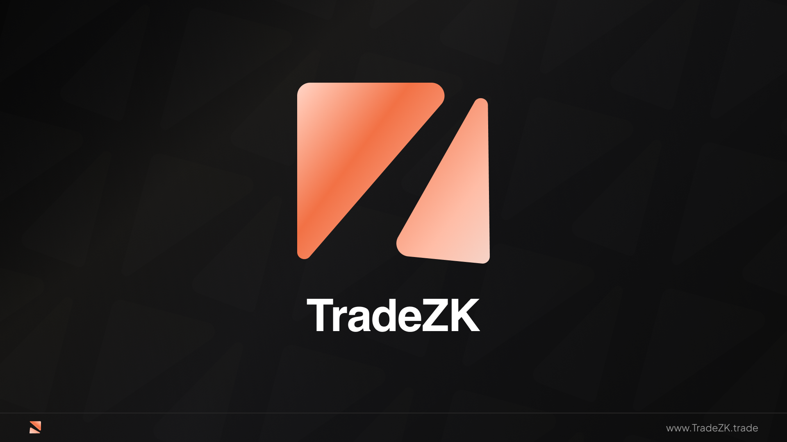
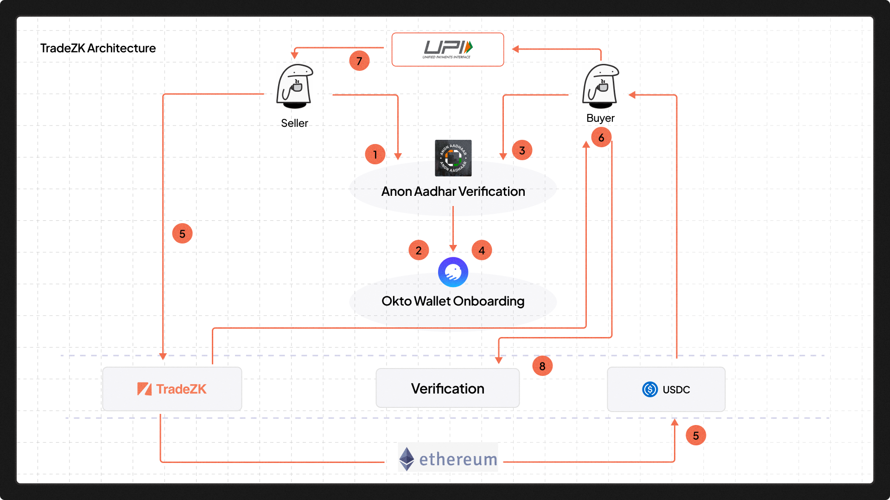

# ZK Trade - Zero Knowledge P2P Trading App

Welcome to ZK-Trade, a decentralized peer-to-peer trading application built on the Polygon Mumbai testnet. This app leverages the power of zero-knowledge proofs for enhanced privacy and security.

## Smart Contracts

### USDC Token Contract
- Contract Address: `0xAf729D03090e5586B48F6e600ac8B5aC7959F8A7`

### ZK-Trade Contract
- Contract Address: `0x3D2DE24CF696eBe80dD768029b597A9b0e750c0A`

## Technologies Used

- [Anon Aadhar](): For ZK-KYC to via Aadhar
- [Okto Wallet](https://okto.tech): Okto Wallet for EOA.
- [Push Protocol](https://push.org): Push Protocol for real-time notifications.
- [Next.js](https://nextjs.org/): Next.js for building the user interface.
- [Polygon Mumbai Testnet](https://mumbai.polygonscan.com/): Polygon Mumbai testnet for deploying and testing smart contracts.

## Technical Flows

